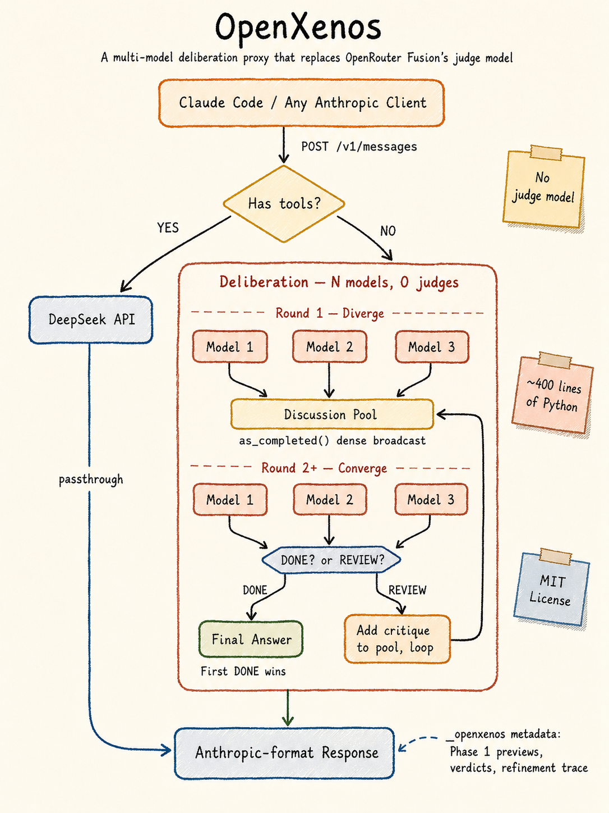

<p align="center">
  
  
  
  
  <br>
  <em>An open-source reimplementation of OpenRouter Fusion, KISS-style — no judge, zero markup, pure Python.</em>
</p>

# OpenXenos

**Multi-model deliberation that reaches its own consensus.**

OpenRouter Fusion fans out your prompt to N models, runs a separate judge model to compare their answers, then synthesizes a final response. Good idea — but the judge is an unnecessary abstraction. The panel models can see each other's work and converge on their own.

That's all OpenXenos does. No judge. No API key markup. No vendor lock-in. ~400 lines of Python.

---

[English](README.md) | [中文](README.zh.md)

---

## vs OpenRouter Fusion

| | OpenRouter Fusion | OpenXenos |
|---|---|---|
| Architecture | panel → judge → synthesize | panel ↔ panel (dense message-passing) |
| Judge model | separate model, extra cost | **none** — models converge on their own |
| Consensus | judge decides | first model to signal DONE wins |
| Output | judge-written | panel-written |
| API format | OpenRouter-proprietary | Anthropic Messages API (transparent proxy) |
| Model diversity | configurable model combinations | sampling stochasticity + temperature |
| Claude Code integration | api_key + model slug | `export ANTHROPIC_BASE_URL=...` |
| Pricing | per-token markup | your own API keys, zero margin |
| Source | closed | `uv run openxenos` |

---

## How It Works



```
POST /v1/messages (Anthropic format)
        │
        ├─ Has tools? → pass-through, zero overhead
        │
        └─ No tools?  → deliberation:
              │
              Round 1: N models answer simultaneously
              │        as_completed() — answers pool up like a group chat
              │
              Round 2+: N models see the full accumulated discussion
              │         each signals DONE or REVIEW
              │         DONE → output immediately
              │         REVIEW → critique added to pool, repeat
              │         max 10 rounds
              │
              → one answer, one voice
```

### Round 1 — Diverge

All N models fire at once with the same prompt. Same model, same parameters — diversity comes purely from sampling stochasticity. Each model produces a slightly different answer: different framing, different emphasis, sometimes different conclusions.

Answers stream into a shared discussion pool via `asyncio.as_completed()` — whoever finishes first gets read first. This is dense: every model's output is immediately visible to the group.

### Round 2+ — Converge

All N models see the complete accumulated discussion pool — Round 1 answers plus all REVIEW critiques from previous rounds. Each independently decides:

- **DONE** — the group has converged. Here's the final answer.
- **REVIEW** — there are still substantive disagreements, gaps, or blind spots. Write a critique and an improved answer.

**First DONE wins.** No majority threshold. No judge picking winners. The moment any model declares consensus, that answer ships.

If all models signal REVIEW, their critiques are added to the discussion pool and another round begins. This repeats until someone says DONE or the maximum rounds (default 10) is reached. REVIEW is never output to the user — it's an internal signal meaning "keep discussing."

### Tool pass-through

When Claude Code sends a request with tools (Bash, Read, Write, Agent…), OpenXenos passes it straight through to DeepSeek — no deliberation overhead. This keeps Claude Code's agent loop fast and responsive. Deliberation only kicks in for pure reasoning tasks.

---

## KISS Design Principles

1. **No judge.** Panel models see each other's work and converge on their own. A separate judge is a cost center and a bottleneck.

2. **No persona engineering.** Diversity comes from sampling. Same model, same temperature, different roll of the dice.

3. **No model-name encoding.** The server is model-agnostic. Whatever model the client sends, it routes to the configured backend. `/v1/models` returns nothing — every model name is valid.

4. **Dense connectivity.** Every model sees every other model's output. Not a chain. Not a tree. A fully connected graph.

5. **Tool transparency.** Tool-using requests pass through untouched. Deliberation is for reasoning, not for running `ls`.

6. **Thin proxy.** Zero format conversion. DeepSeek speaks Anthropic natively. Requests flow through as-is.

---

## Quick Start

```bash
git clone https://github.com/lizixi-0x2F/OpenXenos && cd OpenXenos

# Set your DeepSeek credentials
cp .env.example .env
# Edit .env → ANTHROPIC_AUTH_TOKEN=sk-…

# Install & run
uv sync
uv run openxenos
# → http://0.0.0.0:2222
```

### Claude Code

```bash
export ANTHROPIC_BASE_URL=http://localhost:2222
```

Done. Claude Code now routes every message through 3-model deliberation. Tool calls pass through at native speed. Reasoning questions get the full panel treatment.

### Auto-start (Linux & macOS)

```bash
./install.sh
# Linux  → systemd user service, starts on boot
# macOS  → launchd user agent, starts on boot
# Port:  2222
```

**Linux:**
```bash
systemctl --user status openxenos        # status
journalctl --user -u openxenos -f         # logs
```

**macOS:**
```bash
launchctl list | grep openxenos           # status
tail -f ~/Library/Logs/openxenos.log      # logs
```

---

## Configuration

All via `.env`:

| Variable | Default | Description |
|---|---|---|
| `ANTHROPIC_AUTH_TOKEN` | — | DeepSeek API key (**required**) |
| `ANTHROPIC_BASE_URL` | `https://api.deepseek.com/anthropic` | DeepSeek endpoint |
| `ANTHROPIC_MODEL` | `deepseek-v4-pro` | model name |
| `OPENXENOS_PORT` | `2222` | server port |
| `OPENXENOS_PANEL_SIZE` | `3` | models in the panel |
| `OPENXENOS_PHASE1_TEMP` | `0.8` | divergence temperature |
| `OPENXENOS_PHASE2_TEMP` | `0.5` | convergence temperature |
| `OPENXENOS_MAX_ROUNDS` | `10` | max discussion rounds |

---

## API

### `POST /v1/messages`

Anthropic Messages API compatible. Full pass-through: `system`, `messages`, `tools`, `tool_choice`, `thinking`, `temperature`, `max_tokens` — all forwarded to DeepSeek.

Response includes `_openxenos` metadata: Phase 1 previews, verdicts, failed indices.

### `GET /health`

```json
{"status": "ok", "panel_size": 3, "model": "deepseek-v4-pro"}
```

---

## License

MIT — use freely, fork at will.
